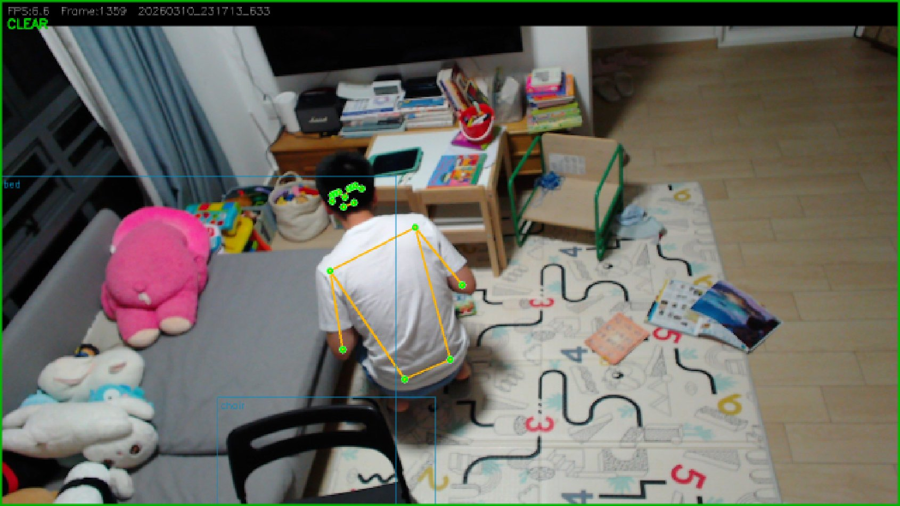
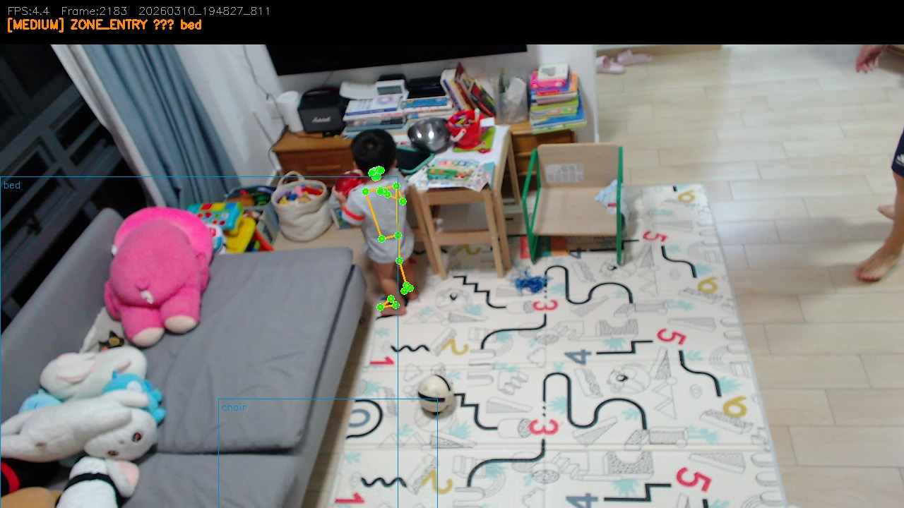
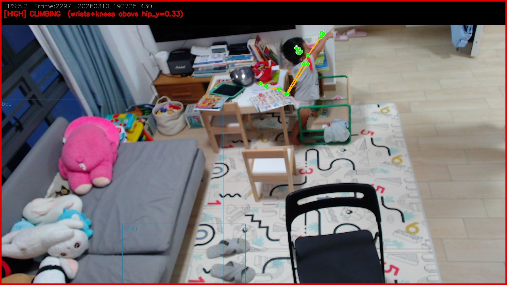
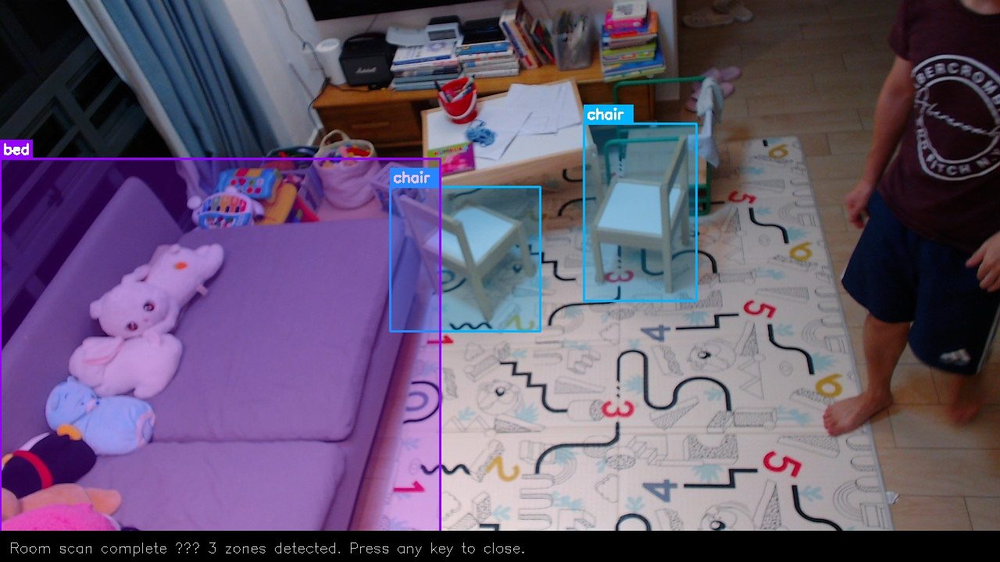

# CaMonitor — Edge AI Nursery Safety Guard

Real-time child safety monitoring using pose estimation on a Raspberry Pi 4.
No cloud, no subscription, no data leaving the device.

Built as a personal project and engineering portfolio piece — deployed to monitor
a 20-month-old toddler at home.

---

## What It Does

CaMonitor runs a full computer vision pipeline on a Raspberry Pi 4 to detect
potentially dangerous situations involving a young child in real time.

**Alert types:**

| Alert | Category | Severity | Trigger |
|---|---|---|---|
| `ZONE_ENTRY` | Spatial | MEDIUM/HIGH | Child enters a mapped danger zone (bed edge, furniture, kitchen) |
| `INVERSION` | Posture | HIGH | Head drops below foot level (tumbling, hanging) |
| `CLIMBING` | Posture | HIGH | Wrists and knees simultaneously above hip level |
| `AIRBORNE` | Posture | MEDIUM | Both ankles above floor baseline |
| `RAPID_DESCENT` | Motion | HIGH | Hip Y-coordinate drops > 4% of frame height per frame |

On detection, the system sends an email notification with alert type, severity,
timestamp, and an attached JPEG frame showing the skeleton overlay.

**Zone severity levels:**
- `MEDIUM` — furniture zones (bed edge, sofa, chairs)
- `HIGH` — kitchen zone (fridge, water tap/basin, and oven used as spatial anchors for zone boundary definition)

Kitchen zone is defined by the convex hull of three anchor objects detected by
YOLOv8: fridge, water tap/basin, and oven. Any keypoint inside this hull triggers
a HIGH-severity alert.

---

## System Output — Real Frames

All frames below are actual system output captured during live testing.

### CLEAR — Adult Detected, Alerts Suppressed



*FPS:6.6 Frame:1359 — Status: CLEAR. Adult in squat/crouch position near desk.
Green border = no active alerts. Orange skeleton overlay with green keypoints tracked correctly.
Adult filter correctly identifies adult body (bbox area > 0.02) and suppresses all alerts
despite low crouching posture — demonstrating orientation-invariant adult classification.*

---

### ZONE_ENTRY — Toddler Enters Bed Zone



*FPS:4.4 Frame:2183 — [MEDIUM] ZONE_ENTRY bed. Toddler standing and playing near
the bed edge zone. Blue zone boxes for bed (top-left) and chair (bottom) visible.
Full toddler skeleton tracked at 0.55 confidence threshold. Adult legs partially
visible on right edge of frame — adult filter correctly suppresses adult body,
alerting only on the toddler.*

---

### CLIMBING — Toddler Reaches Above Hip Level



*FPS:5.2 Frame:2297 — [HIGH] CLIMBING (wrists+knees above hip_y=0.33). Red border
= HIGH severity alert. Toddler reaching upward with arm fully extended above head
level while seated at toy desk. Green keypoints on shoulder, elbow, and wrist chain.
System correctly classifies elevated wrist position as climbing behaviour.*

---

### Room Scan — YOLOv8 Zone Mapping



*Room scan output from `room_scan.py`. YOLOv8 detected 3 zones: bed (magenta filled
polygon, left), chair ×2 (cyan bounding boxes, centre). Zone definitions saved to
`zones_config.yaml` and loaded by `alerts.py` at startup. Re-run whenever camera
position changes.*

---

## System Architecture

```
Camera (Logitech StreamCam, 720p/MJPG mode, top-down ~2m height)
    │
    ▼
OpenCV frame capture (MJPG set before resolution — USB 2.0 bandwidth requirement)
    │
    ▼
MediaPipe BlazePose (TFLite XNNPACK delegate, model_complexity=0)
    │
    ├─► Adult filter (bbox area > 0.02 → adult → skip alerts)
    │   Bounding box of 11 upper-body keypoints
    │   Orientation-invariant for fixed overhead camera
    │
    ├─► Zone alert  (hip/ankle keypoints vs YAML zone boxes)
    │   15-frame persistence filter — requires ~2s sustained detection
    │
    ├─► Posture alerts (inversion, climbing, airborne)
    │
    ├─► Motion alert  (rapid descent — inter-frame hip delta)
    │
    ▼
CSV logging + JPEG frame save + Gmail email notification
```

---

## Benchmark Results

### Phase 1 — Resolution vs Baseline FPS

| Resolution | Avg FPS | Avg CPU | Avg Temp | Peak Temp |
|---|---|---|---|---|
| 480p | 63.12 | 14.3% | 50.2°C | 52.6°C |
| 720p | 62.74 | 25.9% | 52.3°C | 55.0°C |
| 1080p | 37.11 | 30.7% | 54.3°C | 56.5°C |

**Decision:** 1080p consumed 30% CPU before any AI. 720p held 63 FPS capture
at 26% CPU, leaving full headroom for inference.

### Phase 1b — XNNPACK Delegate Verification

TFLite automatically selects the XNNPACK delegate on Raspberry Pi ARM Cortex-A72/A76,
using NEON SIMD to vectorise neural network multiply-accumulate operations —
4 floats processed per CPU instruction instead of 1.

Confirmed active via startup log:
```
INFO: Created TensorFlow Lite XNNPACK delegate for CPU.
```

| Backend | FPS | CPU | Cost | Status |
|---|---|---|---|---|
| Naive CPU (no delegate) | ~2–3 FPS | ~65% | Free | Too slow |
| **XNNPACK / ARM NEON** | **8.63 FPS** | **36%** | **Free, auto-selected** | **✅ Production** |
| GPU delegate (VideoCore) | Not supported | — | Free | ❌ Not available on Pi |
| Coral Edge TPU (USB) | ~25–30 FPS | ~15% | ~S$80 | Future upgrade |

XNNPACK provides ~3× throughput over estimated naive CPU path at zero cost.
Coral Edge TPU evaluated — 8.63 FPS sufficient for monitoring a toddler,
S$80 BOM addition unjustified at current stage.

### Phase 1c — PTQ Accuracy / Latency Sweep

Google ships BlazePose in three quantization operating points (all int8):

| Complexity | Model Size | FPS | Detection Rate | Confidence | Decision |
|---|---|---|---|---|---|
| 0 — lite | 2.7MB | **8.63** | **100%** | 0.997 | ✅ Production |
| 1 — full | 6.2MB | 6.11 | 100% | 0.998 | Reference |
| 2 — heavy | ~26MB | 1.73 | 98% | 0.993 | ❌ Not viable |

Key finding: complexity=0 gives **41% more throughput** than complexity=1 at only
**0.1% confidence drop**. Complexity=2 performed worst overall — inference latency
exceeds frame arrival rate, causing tracking continuity loss (98% detection rate
vs 100% for lighter models). complexity=0 is the unambiguous choice for edge deployment.

---

## Adult / Child Differentiation

### Design Evolution

The system must suppress alerts when a parent is in frame (CHILD_MONITOR mode).
Three approaches were evaluated for a fixed top-down overhead camera — each
failing a distinct edge case:

**Attempt 1 — height_span (nose-to-ankle ratio)**
Works upright but fails when ankles are not visible (sitting, crouching).
Defaults to child classification — triggers false alerts on parent.
Calibrated value: `height_span mean=0.5999, std=0.0429`

**Attempt 2 — head/shoulder width ratio**
Ankles-independent, but fails when parent is side-on to camera — shoulder
width collapses in top-down projection, misclassifying adult as toddler.

**Attempt 3 — Bounding box area (current)**
Orientation-invariant for a fixed overhead camera. An adult body always
occupies more 2D frame area than a toddler regardless of pose or facing direction.
Uses bounding box of 11 upper-body keypoints (nose, shoulders, elbows,
wrists, hips, knees).

### Validated Thresholds

| Subject / Pose | bbox Area | Classification |
|---|---|---|
| Adult standing / moving | 0.087 – 0.189 | ✅ adult=True |
| Adult sitting, side-on | 0.063 – 0.074 | ✅ adult=True |
| Adult crouching low | 0.021 – 0.055 | ✅ adult=True (~90% accuracy) |
| Toddler (20 months) standing | < 0.020 | ✅ child=True (100%) |
| Toddler crawling | < 0.020 | ✅ child=True (100%) |

**Validated threshold:** `bbox_area_threshold: 0.02`
Validated 2026-03-10 with real child subject in frame.

At threshold=0.02, the adult/child gap is well-separated: even a deeply crouching
adult correctly classifies at ~90% accuracy, while toddler detection is 100%.
The 15-frame persistence filter further prevents any misclassified frame from
triggering an alert.

---

## Synthetic Data Strategy

`RAPID_DESCENT` (child falling) is an edge case that cannot be safely collected
in real life. The correct approach is geometric augmentation of real landmark
sequences — scale, flip, and jitter 20 real captures to generate 1000+ synthetic
variants for threshold validation and future classifier training.

```python
def augment_landmarks(landmarks_array, n_augments=50):
    """landmarks_array: shape (n_frames, 33, 3) — x, y, visibility"""
    augmented = []
    for _ in range(n_augments):
        aug = landmarks_array.copy()
        aug[:, :, :2] *= np.random.uniform(0.8, 1.2)     # scale
        if np.random.random() > 0.5:
            aug[:, :, 0] = 1.0 - aug[:, :, 0]            # horizontal flip
        aug[:, :, :2] += np.random.normal(0, 0.01,
                         aug[:, :, :2].shape)              # jitter
        aug[:, :, :2] = np.clip(aug[:, :, :2], 0, 1)
        augmented.append(aug)
    return augmented
```

---

## Project Structure

```
camonitor/
├── scripts/
│   ├── alerts.py                    # Main monitoring loop
│   ├── benchmark.py                 # Baseline benchmark harness
│   ├── ptq_benchmark.py             # PTQ complexity sweep benchmark
│   ├── room_scan.py                 # YOLOv8 zone detection
│   ├── calibrate_adult.py           # Adult profile calibration
│   ├── email_notifier.py            # Gmail SMTP notification
│   ├── config.yaml                  # Master config
│   ├── adult_profile.yaml           # Saved calibration ratios
│   ├── zones_config.yaml            # Room zone definitions
│   └── email_config_template.yaml   # Credential template
├── logs/
│   ├── benchmark_baseline.csv
│   ├── benchmark_inference.csv
│   ├── ptq_benchmark.csv
│   └── alerts_log.csv
├── data/
│   └── room_scan_result.jpg
├── docs/
│   └── screenshots/
│       ├── clear_adult_squat.png    # Adult crouching — CLEAR, alerts suppressed
│       ├── alert_zone_entry.jpg     # Toddler ZONE_ENTRY bed alert
│       ├── alert_climbing.jpg       # Toddler CLIMBING HIGH alert
│       └── room_scan_result.jpg     # YOLOv8 zone mapping output
└── README.md
```

---

## Setup

Tested on Raspberry Pi 4 (4GB), Raspberry Pi OS 64-bit, Python 3.11/3.12.

```bash
conda create -n camonitor python=3.11
conda activate camonitor
pip install -r requirements.txt
```

### Camera Setup Note

Set MJPG format **before** resolution — required for USB 2.0 bandwidth:

```python
cap.set(cv2.CAP_PROP_FOURCC, cv2.VideoWriter_fourcc(*'MJPG'))  # FIRST
cap.set(cv2.CAP_PROP_FRAME_WIDTH, 1280)
cap.set(cv2.CAP_PROP_FRAME_HEIGHT, 720)
```

If reversed, camera falls back to YUYV — 3× USB bandwidth, causing frame drops.

---

## Running

### Step 1 — Room Scan (once per camera position)
```bash
python scripts/room_scan.py
```
YOLOv8 maps furniture into zone boxes. Saves `zones_config.yaml`.
For kitchen zone: ensure fridge, water tap/basin, and oven are visible in frame
during scan — YOLOv8 uses these as spatial anchors for the kitchen exclusion zone.

### Step 2 — Adult Calibration (once)
```bash
python scripts/calibrate_adult.py
```
Stand in frame for ~8 seconds. Saves `adult_profile.yaml`.

### Step 3 — Configure
```yaml
# config.yaml
mode: CHILD_MONITOR        # ADULT_TEST during development
debug: false               # true prints bbox area values for threshold tuning
adult_filter:
  bbox_area_threshold: 0.02  # validated 2026-03-10
```

### Step 4 — Monitor
```bash
# Foreground
python scripts/alerts.py

# Background (24/7)
nohup python scripts/alerts.py >> logs/monitor.log 2>&1 &
```

### Step 5 — PTQ Benchmark (optional)
```bash
python scripts/ptq_benchmark.py
```
Stand in frame during each complexity level run (~5 min total).

---

## Email Notifications

```bash
cp scripts/email_config_template.yaml scripts/email_config.yaml
chmod 600 scripts/email_config.yaml
nano scripts/email_config.yaml        # add Gmail App Password
```

Gmail → Security → 2-Step Verification → App Passwords → generate for CaMonitor.

---

## Configuration Reference

```yaml
mode: CHILD_MONITOR     # ADULT_TEST or CHILD_MONITOR
debug: false            # true = print bbox area values for threshold tuning

adult_filter:
  enabled: true
  bbox_area_threshold: 0.02   # validated — 100% child detection, ~90% adult at crouch

mediapipe:
  min_detection_confidence: 0.55
  min_tracking_confidence: 0.55
  model_complexity: 0         # 8.63 FPS, 100% detection, 0.997 confidence

alerts:
  zone_entry_frames: 15       # ~2 seconds persistence before alert fires
  inversion_buffer: 0.05
  descent_threshold: 0.04

email:
  enabled: true
  cooldown_sec: 300

performance:
  idle_sleep_sec: 0.3
```

---

## Known Limitations

**Adult presence = child safe:** The system suppresses all alerts when an adult
body is detected in frame. This is intentional — an adult present means the child
is supervised. The monitor is designed for unsupervised periods only.

**BlazePose on toddlers:** Model trained predominantly on adults. Lower keypoint
confidence expected for a 20-month toddler's body proportions.
`min_detection_confidence: 0.55` set lower than default 0.60 to compensate.
In practice, toddler skeleton tracked reliably at this threshold as shown in
the ZONE_ENTRY and CLIMBING frames above.

**RAPID_DESCENT camera height dependency:** Requires camera at 1.8–2m height for
sufficient hip Y range per frame at 8 FPS. At monitor-level mounting, hip vertical
range is insufficient to exceed the per-frame delta threshold. Known hardware
deployment constraint — not a logic bug.

---

## Roadmap

- [ ] LivenessChecker — reject static false detections (stuffed animals, sheet creases)
- [ ] RAPID_DESCENT validation at current camera height
- [ ] Kitchen zone implementation — fridge/basin/oven anchor detection in room_scan.py
- [ ] Spatial floor calibration — user-defined floor plane for posture alerts
- [ ] Dynamic thresholding — confidence gate based on frame brightness
- [ ] Threading pipeline — producer/consumer for capture, inference, alert logic
- [ ] PWA dashboard — Flask server + mobile live view
- [ ] Synthetic data augmentation script for RAPID_DESCENT training data

---

## Hardware

- Raspberry Pi 4 (4GB RAM)
- Logitech StreamCam USB webcam (720p/MJPG, top-down ~2m height)
- Camera angled 15–20° downward for full room coverage
- Fan case recommended for sustained all-day operation

---

## License

MIT — personal project, provided as-is.
Not a substitute for direct supervision or commercial child safety products.
